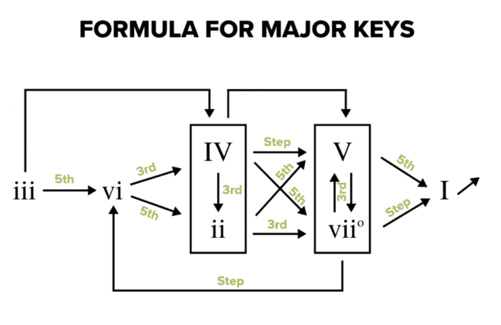

# Guitar_Chord_Progression_Generator_Android_Application
Android application that generates a chord progression. Created from a personal desire to practice chord progressions on the guitar.

This application generates a random chord sequence of a user specified length. The randomized chord generator follows the three most common root movements;
movement by 5th, by 3rd, or by step. The reasoning behind this choice is that generally, these movements sound pleasant to the ear regardless of the chords involved.
However, there are many more possibilites to the rules that influence the generation of chord sequences. 

In the future, a more advanced chord generation algorithm would include rules that allow for out of key chord substitutions rather than the chords in one key.

See link below for diagram that shows how the program creates a basic chord progression. 

https://www.musicnotes.com/now/musictheory/chord-progression-formulas/

There are 4 forms of user input for this application:

Generation algorithm:
     Specifies which algorithm is used to generate the chord progression

Number of chords:
     Specifies the length of the generated chord progression
    
Key:
     Specifies the current key
    
Chord Flavor:
     Currently there is 2
         Normal - Major
         Maj7 - Major7
        
        
Credit to loading animation:
    https://lottiefiles.com/103523-abstract-isometric-loader-1 - By Rehan Ansari
